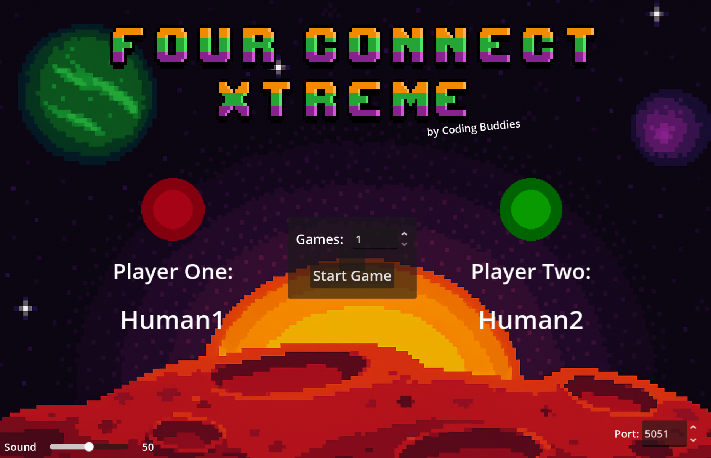
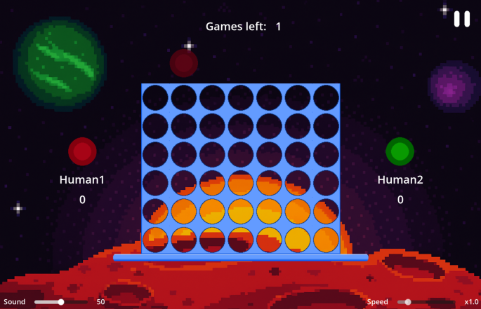
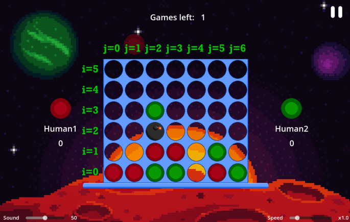
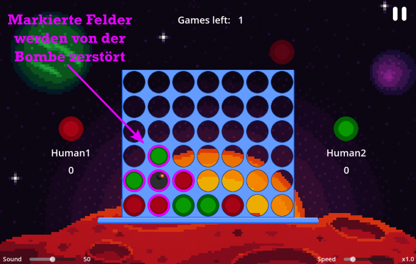
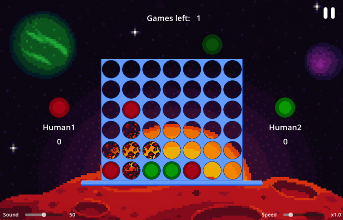
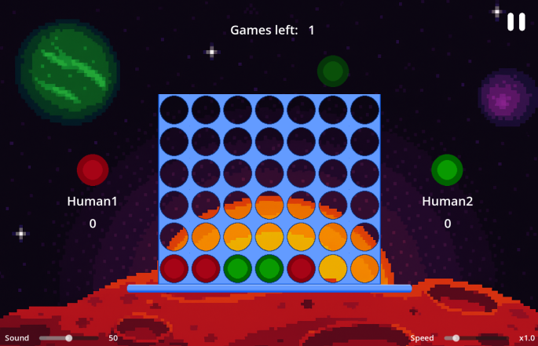

# Willkommen zum Programmier-Wettbewerb "Four Connect Xtreme" von den Coding Buddies!

Die Implementierungsphase der Bots startet am 21.10.2025 und endet am 21.11.2025.

**Grundsätzlich gilt:**

Solltet ihr Fragen haben oder Hilfe benötigen. Scheut euch nicht uns auf unseren Plattformen zu kontaktieren!

Oder tauscht euch hier mit anderen Teilnehmer:innen aus: https://discord.gg/C2Zntw6Sq4

\
**UND ACHTUNG! Der Spaß und das Lernen steht im Vordergrund also macht mit :)** <br>

## Aufgabe

Es ist ein **Bot** zu entwickeln, der nach den **Standardregeln** das Spiel "4 Gewinnt" spielt. Allerdings gibt es auch
Bomben! Hierfür haben wir eine Schnittstelle für verschiedene Clients (aktuell sind 7 Sprachen unterstützt) bereit gestellt, welche implementiert
werden muss. Das Ziel ist es, die Spiele gegen eine Gegner KI zu gewinnen und als Turniersieger
hervorzugehen! :)

## Teilnahmebedingungen

- Implementierung der vorgegebenen Bot Schnittstelle (in der Sprache deiner Wahl)
- Der Bot ist lauffähig und bedient korrekt die Schnittstelle
- Der Bot spielt einen gültigen Zug innerhalb einer festgelegten Zeit (Timeout = 700 Millisekunden)
- Der Bot ist von dir

### Was beinhaltet das Repository?

- Das Four Connect Xtreme Spiel + Source Code Godot
- Die Bot Clients in den jeweiligen Sprachen:
    - Python
    - Java
    - C#
    - Kotlin
    - Rust
    - Go
    - TypeScript

## Das Game starten

Du hast 2 Möglichkeiten das Spiel zu starten:

1) Starte die FourConnect.exe, die im Game Ordner liegt (als zip Datei, also vorher entpacken)
2) Lade dir die Godot Engine hier herunter: https://godotengine.org/. Starte die Engine, klicke auf import. Navigiere in
   den Game-Ordner wo sich die project.godot befindet und klick auf "select current folder" und bestätige mit "Import &
   Edit". Anschließend kannst du das Spiel mit dem "Play" Button in der oberen rechten Ecke der Engine starten. Solltest
   du gefragt werden, welche die Default-Szene des Spiels ist gib "startmenu.tscn" an.

Hast du das Spiel auf eine der beiden Arten gestartet, dann siehst du das Hauptmenü des Spiels.

### Das Hauptmenü

Das Hauptmenü sieht wie folgt aus:\
\
\
Was siehst du, was kannst du einstellen?

1) Es gibt Player One und Player Two (Standardmäßig können 2 Personen manuell spielen)
2) Auf Player One und Player Two kann man Bots verbinden (siehe nachfolgende Abschnitte)
3) In der Mitte kannst du die Anzahl der zu spielenden Partien einstellen, welche hintereinander gespielt werden
4) Unten links kannst du die Sound Lautstärke des Spiels von 0 (stumm) bis 100 (max. Lautstärke) regeln.
5) Unten rechts kannst du den Port einstellen auf dem sich dein Bot connecten soll (default: 5051)
6) Start Game...wichtig, startet das Spiel mit den aktuellen Einstellungen 😄

### Bots verbinden

- **Du willst gegen deinen eigenen Bot spielen?** Starte deinen Bot (er connected sich automatisch, wenn der Server
  läuft und der Port korrekt eingestellt ist), dann erscheint der Name deines Bots unter "Player One". Startest du das
  Spiel, kannst du gegen deinen eigenen Bot antreten.
- **Du willst deinen Bot gegen sich selber oder eine andere Version deines Bots antreten lassen?** Starte deinen Bot 2
  mal bzw. deine beiden Bot-Versionen, die antreten sollen. Die Namen der Bots erscheinen unter "Player One" und "Player
  Two". Startest du das Spiel, so duellieren sich die beiden Bots.

### Das Spielfeld

\
\
Das Game zeigt beide Player und welche Chipfarbe zu welchem Player gehört. In der unteren rechten Ecke kannst du die
Geschwindigkeit des Spiels von x0.5 bis x4.0 einstellen. In der oberen rechten Ecke kannst du das Spiel jederzeit
pausieren.

### Die Daten vom Server

Der Server überträgt initial eine Ping Message zum Verbindungsaufbau. 
**Diese ist für den Bot nicht weiter relevant.**

Anschließend überträgt der Server  nach jedem gespielten Spielstein die folgenden Daten (PlayState):

**Überblick**\
PlayState sind JSON-Daten, die den Zustand der Partie zum aktuellen Zeitpunkt liefern.\
\
**Struktur**\
Die JSON-Daten bestehen aus 5 Hauptbereichen:

1) bot: Name des Bots, für den die Daten bestimmt sind bzw. welcher aktuell an der Reihe ist
2) coin_id: Id des Spielsteins des Bots auf dem Feld
3) round: Die aktuelle Runde des Matches
4) bombs: Die Daten der Bomben, die sich im Spiel befinden
5) board: Aktueller Zustand des Spielbretts mit den entsprechenden Spielsteinen darin

**Detaillierte Beschreibung der Attribute** 

- bot: (Typ: String) \
  Beschreibung: Name des Bots für den die Daten bestimmt sind\
  Beispiel: `````"bot": "mySuperCoolBotName"`````
- coin_id: (Typ: int)\
  Beschreibung: Id des Spielsteins den der Bot spielt. Spieler1: Id=1, Spieler2: Id=2\
  Beispiel: `````"coin_id": 1`````
- round: (Typ: int)\
  Beschreibung: Aktuelle Runde des Matches. Hat jeder 2 Steine geworfen, folgt Runde 5
  Beispiel: ````"round": 5````
- bombs: (Typ: Liste von Objekten)\
  Beschreibung: Eine Liste von Bomben-Objekten. Gibt Aufschluss über die Position der Bombe(n) und wann sie jeweils
  explodiert\
  Anmerkung: Es wird nie mehr als eine Bombe gleichzeitig im Spiel auftreten\
  Struktur eines Bomben-Objektes:

| Attribut         | Typ | Beschreibung                                |
|------------------|-----|---------------------------------------------|
| row              | int | In welcher Reihe liegt die Bombe            |
| col              | int | In welcher Spalte liegt die Bombe           |
| explode_in_round | int | In welcher Runde wird die Bombe explodieren |

&nbsp;&nbsp;&nbsp;&nbsp;&nbsp;&nbsp;&nbsp;Beispiel:

```json
  "bombs": [
    {
      "row": 2,
      "col": 1,
      "explode_in_round": 23
    }
  ]
```

- board: (Typ: Liste von Listen aus ints)\
  Beschreibung: Aktueller Zustand des Spielfeldes
  Anmerkung: 1 und 2 sind Spielsteine der Spieler, 0 sind freie Felder, 99 markiert eine Bombe
  Beispiel:

````json
"board": [
  [1, 1, 2, 2, 0, 1, 2],
  [0, 0, 1, 1, 0, 2, 0],
  [0, 0,99, 0, 0, 0, 0],
  [0, 0, 2, 0, 0, 0, 0],
  [0, 0, 0, 0, 0, 0, 0],
  [0, 0, 0, 0, 0, 0, 0]
]
````

**Boarddaten zum Spielfeld**
Die Daten aus dem "board"-Feld kann man sich wie folgt vorstellen:

```  
       j=0   j=1   j=2   j=3   j=4   j=5   j=6 
i=0: [  1  ,  1  ,  2  ,  2  ,  0  ,  1  ,  2  ]
i=1: [  0  ,  0  ,  1  ,  1  ,  0  ,  2  ,  0  ]
i=2: [  0  ,  0  , 99  ,  0  ,  0  ,  0  ,  0  ]
i=3: [  0  ,  0  ,  2  ,  0  ,  0  ,  0  ,  0  ]
i=4: [  0  ,  0  ,  0  ,  0  ,  0  ,  0  ,  0  ]
i=5: [  0  ,  0  ,  0  ,  0  ,  0  ,  0  ,  0  ]
``` 

das dazugehörige Spielfeld sieht wie folgt aus:\


### Antwort des Clients an den Server

Die Bot-Schnittstelle sendet als Ergebnis den nächsten Zug des Bots an den Server.  (Siehe Play Funktion)
Dieser wird durch die ausgewählte Spalte im Spielfeld dargestellt (Integer von 0 bis 6)
Weitere Infos dazu in den Clients selbst. 🙂

### Achtung vor den Bomben

**Was hat es mit der Bombe auf sich?:**

- Wenn eine Bombe im Spiel erscheint, hat jeder Spieler 2 Runden Zeit sich darauf vorzubereiten. Eine Bombe explodiert
  also nach 4 Zügen.
- Eine Bombe spawnt zufällig und in einer zufälligen Spalte
- wenn eine Bombe explodiert, explodieren auch alle Spielsteine, die in einem Kreuz an die Bombe grenzen\
  
- nach einer Explosion (nachfolgend 1. Bild) fallen Steine nach unten, sollten sich durch die Explosion Spielsteine in
  der Luft befinden und
  das Spielfeld ordnet sich neu (nachfolgend 2. Bild)\
  \
  

- Sollte sich daraus einer 4-Reihe ergeben, hat derjenige Spieler die Partie gewonnen.

### Allgemeines

- Ein Match besteht aus 11 Partien
- Es wird zufällig entschieden welcher Bot das Match startet (hat den 1. Wurf der 1. Partie)
- Anschließend wird der 1. Wurf nach jeder Partie gewechselt
- Beispiel: Spieler 1 beginnt in Runde 1 mit dem 1. Wurf, so hat Spieler 1 auch den 1. Wurf in jeder ungeraden Partie
  eines Matches. Spieler 2 dem zur Folge in jeder geraden Partie des Matches.

### Wie gewinne ich?

- Ein Partie gewinnst du, wenn du 4 gleiche Steine in einer Reihe hast (diagonal, horizontal oder vertikal)
- Eine Match gewinnst du, wenn dein Bot den anderen in einem Spiel aus "Best-of-11" schlägt
- Das Turnier gewinnst du, wenn du das Finale Match gewinnst

### Wichtig um nicht zu verlieren

- Dein Bot muss seinen nächsten Zug innerhalb von 700 Millisekunden an den Server schicken, nachdem er ein Update vom Server
  erhalten hat.
- Dein Bot darf keine invaliden Daten schicken, er muss die Schnittstelle bedienen.
- Wirft dein Bot in eine bereits volle Spalte oder in eine Spalte, die nicht existiert, verliert der Bot die Partie.


## Clients verbinden
Jeder Client hat eine eigene Readme 😉

**Achtung: Bitte verwendet keine Leerzeichen (Spaces) in euren Botnamen. Nutzt dafür z. B. Unterstriche _ 🙂**

# Keep Coding 🫳
